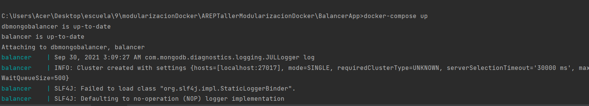
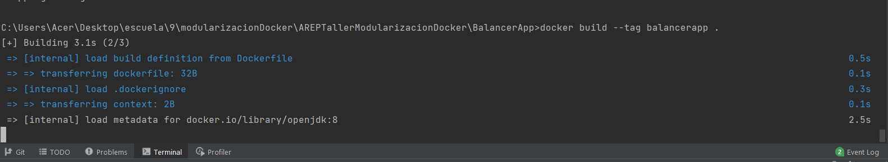
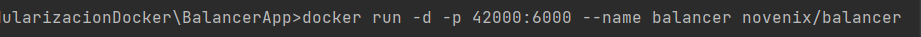
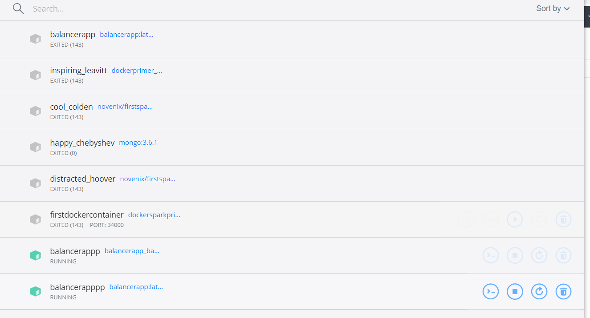

AREPTallerModularizacionDocker
# TALLER DE ARQUITECTURAS DE SERVIDORES DE APLICACIONES, META PROTOCOLOS DE OBJETOS, PATRÓN IOC, REFLEXIÓN
# Prerrequisitos
+ Git version 2.25.1
+ Apavhe Maven version 4.0.0
+ Java version 11.0.11
## Taller AREP 2021-2 
en este taller se crea un servidor webel cual es posible entregar paginas htmlsm ademas de esto el servidor tiene inversion of control y se construye la app a travez de pojos
, esta app debe ser desplegada en docker y este docker a su vez debe estar desplegado en una instancia EC2 de amazon web services.

pasos:
se usa docker compose para  iniciar la configuracion automatica de nuestro docker

luego construimos la imagen de docker para nuestra aplicacion con su puerto

docker run 

# Licencia
MIT

# Autor
*Nicolas Torres*